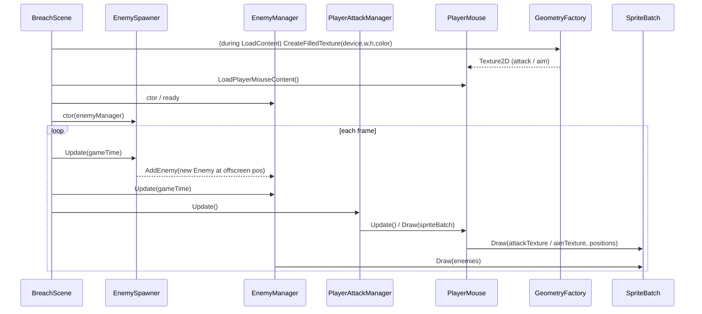

# VirusBuster

VirusBuster is a 2D Arcade game prototype built with MonoGame and structured for scalability, clarity, and future systems development.  
The project uses a simple scene architecture to keep screens modular while leaving room for complex gameplay, stat progression, and skill‑tree mechanics.

## Overview

The current version includes:
- A lightweight scene system (clean separation of screens)
- A custom engine layer (`Core`) that handles graphics, content, and scene flow

## Tech Stack

- MonoGame 3.8+
- .NET 9
- MGCB Content Pipeline

## Roadmap

- Core gameplay loop  
- Player stats + scaling system  
- Skill tree with branching upgrades  
- Enemy waves + difficulty progression  
- UI and menu scenes  
- Visual effects + polish  

## Launch Game

- dotnet run --project VirusBuster.csproj
